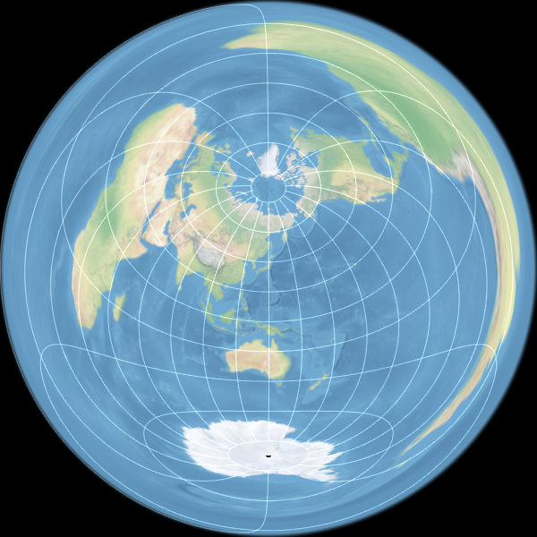
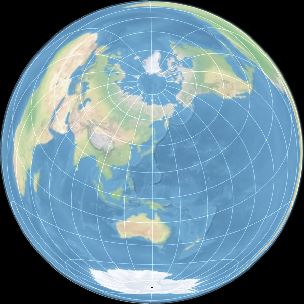
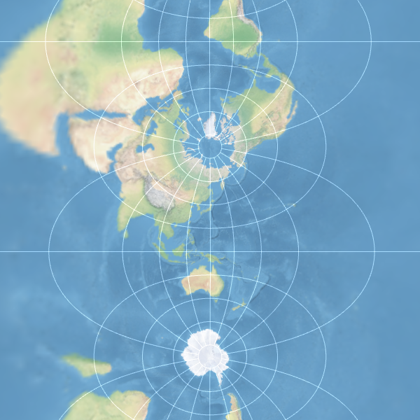
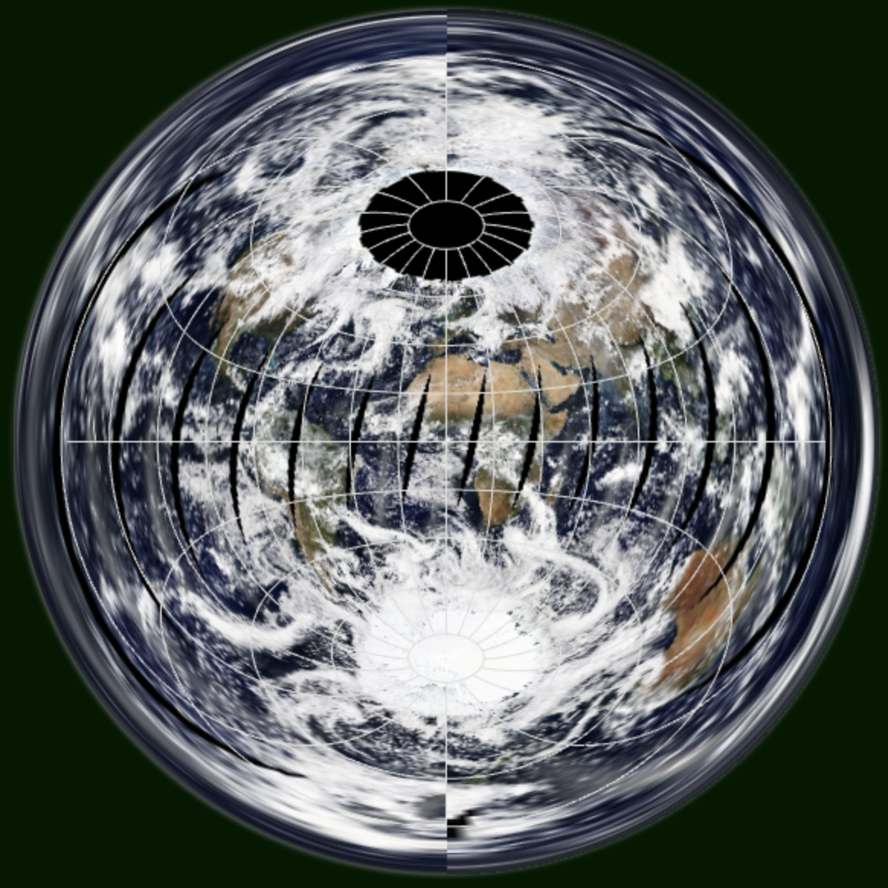

raster-map-projection
==============
WebGLを用いたラスタタイル画像投影変換JavaScriptライブラリ

ベクタデータに加えてラスタタイルデータの投影変換に対応したライブラリです。
緯度経度座標系(EPSG:4326)上のラスタタイル画像を投影変換してCanvas上に表示します。
WebGLを用いて動的に投影変換を行うため、リアルタイムでの投影中心の変更や拡大縮小等の操作も可能です。

特徴
-----
* タイル状に分割されたラスタ画像のWebGLによる動的な投影変換が可能。
* 表示中の画面の矩形から、それを包含する緯度経度座標系上の矩形を算出する方法を定式化。

これにより、表示中の領域に応じて必要となる緯度経度座標系上のタイル画像を算出し、サーバからのタイル画像の取得や描画を効率良く行うことを可能としています。また拡大縮小に合わせて使用するタイル画像の解像度を柔軟に調整することも可能です。

サポートする座標系
-----
* 正距方位図法 Azimuthal Equidistant Projection
* ランベルト正積方位図法 Lambert Azimuthal Equal-Area Projection
* 横メルカトル図法 Transverse Mercator Projection

デモ
-----
http://www.flatearthlab.com/WebGL/

  
Fig.(1) Azimuthal Equidistant Projection - 正距方位図法

  
Fig.(2) Lambert Azimuthal Equal-Area Projection - ランベルト正積方位図法

  
Fig.(3) Transverse Mercator Projection - 横メルカトル図法

  
Fig.(4) Azimuthal Equidistant Projection - 正距方位図法

----
Copyright (C) 2016-2018 T.Seno All rights reserved.
