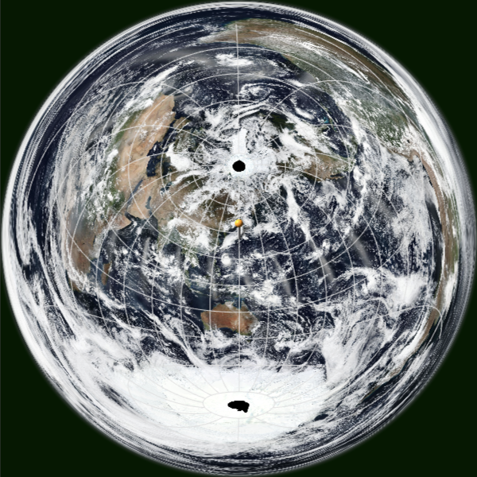

raster-map-projection
==============
raster-map-projection is a JavaScript library for on-the-fly map projection of raster tiles using WebGL.

This is a JavaScript library enabled to on-the-fly map projection of raster tiles in addition to vector data. The tile images on the latitude-longitude coordinate system are projected and displayed on the canvas. Since the map-projection is performed using WebGL, it is possible to operate such as changing the center of the projection in real time.

Features
-----
* It is available on-the-fly map projection of raster tiles using WebGL.
* Formulate a method to calculate a rectangle on the latitude-longitude coordinate system that contains the rectangle of the screen being displayed.

These features make it possible to retrieve and render tile images necessary for display efficiently even when map projection for the original tile images is required. It is also possible to flexibly adjust the resolution of the tile images to be used according to scaling.

Supported map projections
-----
* Azimuthal Equidistant Projection
* Lambert Azimuthal Equal-Area Projection
* Transverse Mercator Projection

Demo
-----
https://tomosn.github.io/raster-map-projection-demo/

http://www.flatearthlab.com/WebGL/

http://www.flatearthlab.com/WebGL/fullwindow_VIIRS.html

  
Fig.(1) Azimuthal Equidistant Projection

  
Fig.(2) Lambert Azimuthal Equal-Area Projection

  
Fig.(3) Transverse Mercator Projection

  
Fig.(4) Azimuthal Equidistant Projection

----
Copyright (C) 2016-2018 T.Seno All rights reserved.
