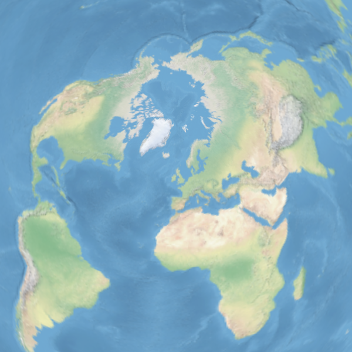
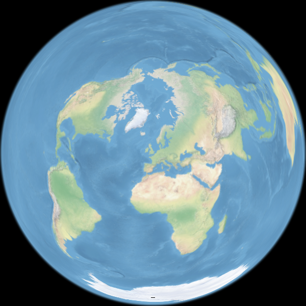

raster-map-projection
==============
raster-map-projection is a JavaScript library for projection of raster tiles using WebGL.

Demo
-----
http://www.flatearthlab.com/WebGL/

  
Fig.(1) Azimuthal Equidistant Projection

  
Fig.(2) Lambert Azimuthal Equal-Area Projection

----
Copyright (C) 2016 T.Seno
