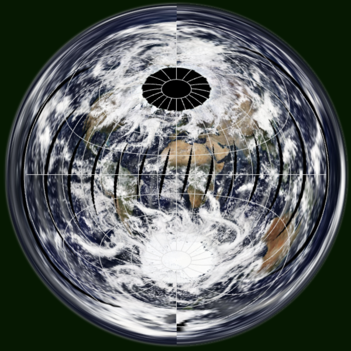

raster-map-projection
==============
raster-map-projection is a JavaScript library for projection of raster tiles using WebGL.

Supported map projections
-----
* Azimuthal Equidistant Projection
* Lambert Azimuthal Equal-Area Projection
* Transverse Mercator Projection

Demo
-----
http://www.flatearthlab.com/WebGL/

  
Fig.(1) Azimuthal Equidistant Projection

  
Fig.(2) Lambert Azimuthal Equal-Area Projection

  
Fig.(3) Transverse Mercator Projection

  
Fig.(4) Azimuthal Equidistant Projection

----
Copyright (C) 2016-2018 T.Seno All rights reserved.
