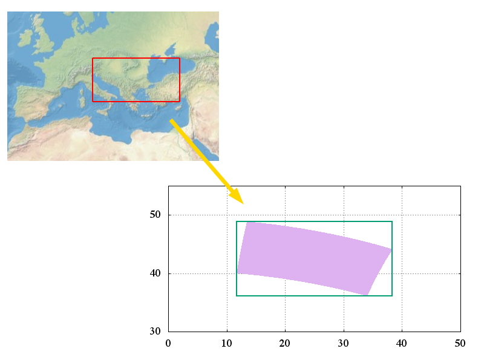
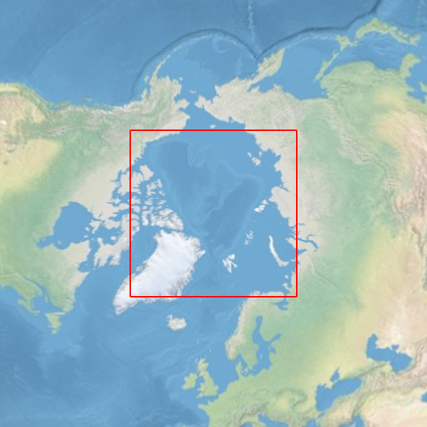
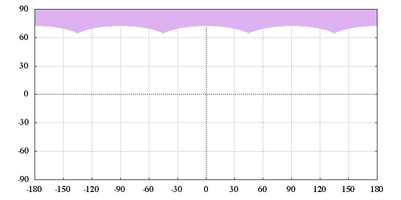
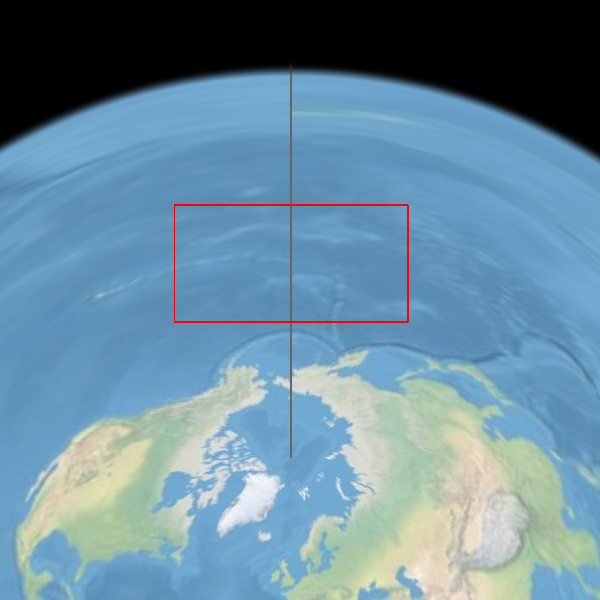
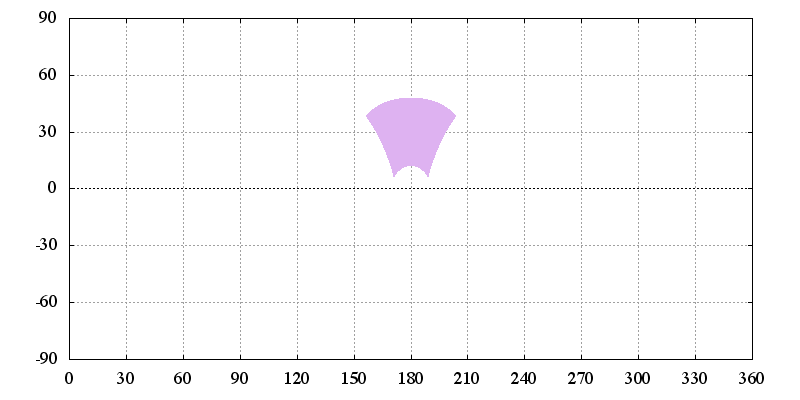
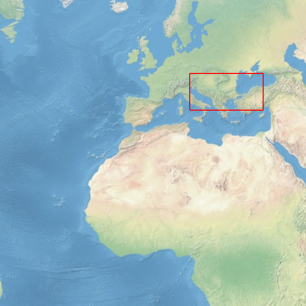
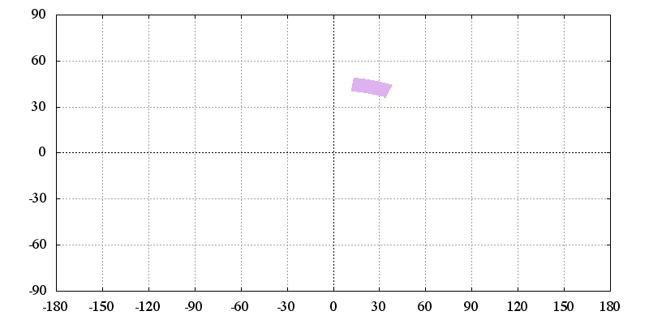
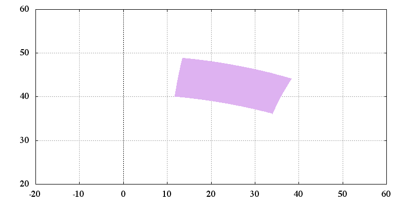

Summary of calculations of inverseBoundingBox
==============

# inverseBoundingBox method of projection class

  
Fig. (a) inverseBoundingBox

***

# Calculations of inverseBoundingBox in the azimuthal equidistant projection

## Introduction

### 1. The case that the rectangle intersects either pole

  
Fig. (1-1) An example that the rectangle contains the North Pole.

  
Fig. (1-2) The geometry that transformed to geographic coordinates.

Reference:
[https://www.jasondavies.com/maps/bounds/](https://www.jasondavies.com/maps/bounds/)

### 2. The case that the rectangle intersects the meridian (except poles)

  
Fig. (2-1) An example that the rectangle intersects the meridian.

  
Fig. (2-2) The geometry that transformed to geographic coordinates.

### 3. The general case

  
Fig. (3-1) An example of the general case.

  
Fig. (3-2) The geometry that transformed to geographic coordinates.

  
Fig. (3-3) The geometry that transformed to geographic coordinates (zoomed in).

### The case that the center point of projection is either pole

***

## Details of the general case

TBD

----
Copyright (C) 2016 T.Seno
